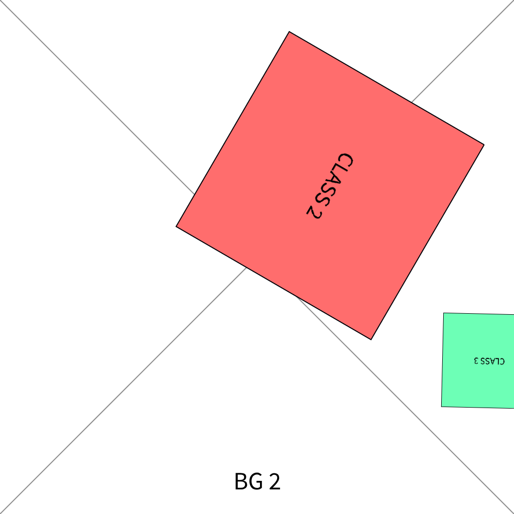
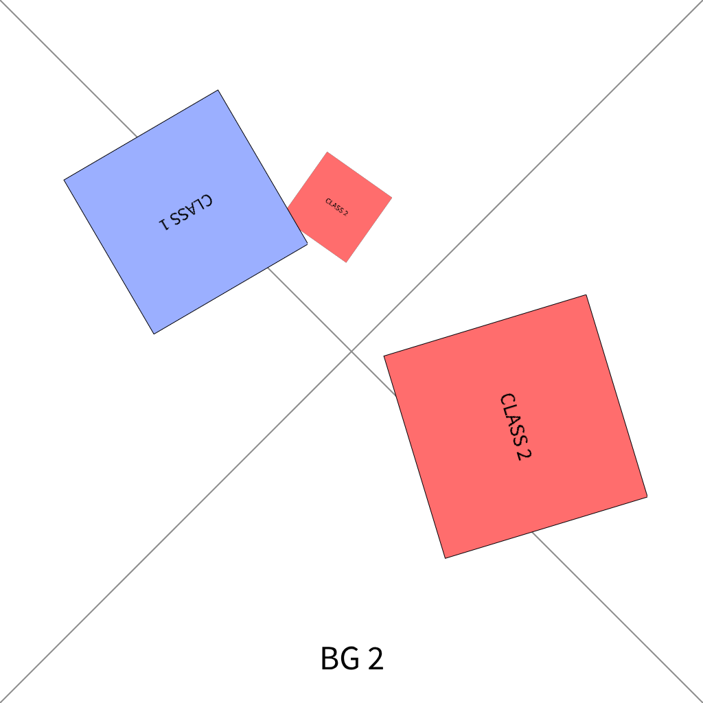
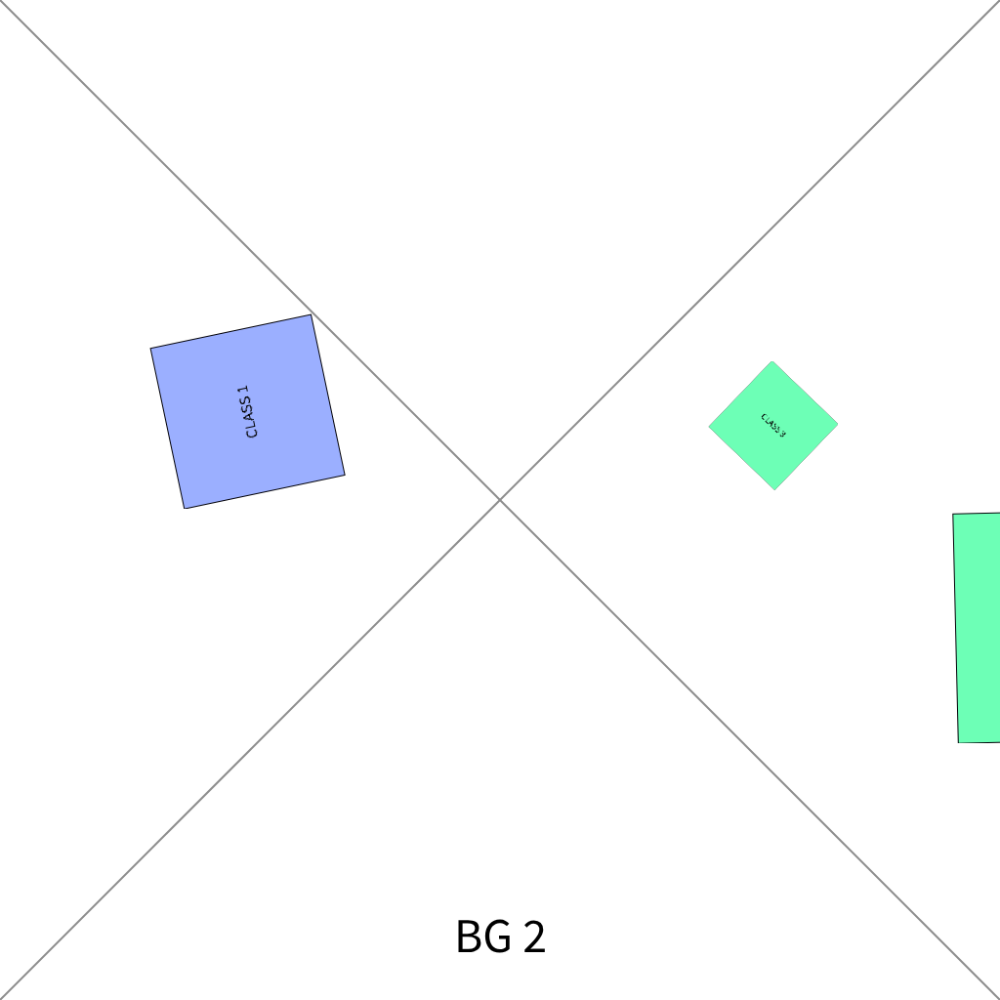

<div align="center">
  <a href="https://iaca-electronique.com">
    
  </a>

# Synthetic data generator for Yolo


</div>

___

## 💬 Purpose

This program allows you to create synthetic data for YOLO object detection models, enhancing training datasets with realistic and diverse examples.

## 📖 Usage

```bash
program \
  --background-dir <path_to_background_images> \
  --object-dir <path_to_object_images> \
  [--distraction-dir <path_to_distraction_images>] \
  --output-dir <path_to_output_directory> \
  --count <number_of_images> \
  [--train-ratio <percent>] \
  [--val-ratio <percent>] \
  [--test-ratio <percent>] \
  [--thread-count <threads>]
```

| Argument | Short | Required | Default | Description |
|---|---|---|---|---|
| `--background-dir` | | yes | | Path to background images |
| `--object-dir` | | yes | | Path to object images (organized in subfolders by category) |
| `--distraction-dir` | | no | | Path to distraction images |
| `--output-dir` | | yes | | Path to output directory |
| `--count` | `-c` | yes | | Number of images to generate |
| `--train-ratio` | | no | `80` | Percentage of images for training |
| `--val-ratio` | | no | `10` | Percentage of images for validation |
| `--test-ratio` | | no | `10` | Percentage of images for testing |
| `--thread-count` | `-j` | no | `1` | Number of threads to use |

> Object directory should contain images of the objects you want to detect in YOLO format (JPEG or PNG). Place each category of objects in its own subfolder (e.g., `object_dir/vehicle`, `object_dir/person`, etc.).

### Example

> Base of generated data is from [assets/](assets/) directory. 

```bash
docker run -v $(pwd):/shared iacaelectronique/synthetic-data-generator-for-yolo:latest \
 --background-dir /shared/assets/bg/ \
 --object-dir /shared/objects/ \
 --output-dir /shared/out/gen_100 \
 -j 8 \
 -c 100
```

> *Generated data*: `out/gen_100/` directory.

|                                                                              |                                                                            |                                                                            |
|:----------------------------------------------------------------------------:|:--------------------------------------------------------------------------:|:--------------------------------------------------------------------------:|
|    |  |  |
|                                    **1**                                     |                                   **2**                                    |                                   **3**                                    |

**1**
```txt
0 0.9423828 0.28125 0.7207031 0.6621094 0.33984375 0.4404297 0.56152344 0.059570313
0 1.0390625 0.7939453 0.8564453 0.7890625 0.8613281 0.6064453 1.0439453 0.6113281
```
**2**
```txt
0 0.46484375 0.21582031 0.5566406 0.28125 0.49121094 0.37304688 0.39941406 0.3076172
0 0.8330078 0.4189453 0.92089844 0.7080078 0.63183594 0.79589844 0.5439453 0.50683594
0 0.4375 0.3466797 0.21679688 0.47558594 0.087890625 0.2548828 0.30859375 0.12597656
```
**3**
```txt
0 0.18359375 0.5078125 0.14941406 0.3466797 0.31054688 0.3125 0.34472656 0.4736328
0 1.1875 0.7373047 0.95703125 0.74316406 0.9511719 0.5126953 1.1816406 0.50683594
0 0.7714844 0.36132813 0.8378906 0.4248047 0.77441406 0.49121094 0.7080078 0.42773438
```
## 🚀 Run

### Dockerhub

```bash
docker run iacaelectronique/synthetic-data-generator:latest # See "Usage" section for arguments
```

### Docker local

```bash
docker build -t synthetic-data-generator -f deployment/Dockerfile .

docker run synthetic-data-generator # See "Usage" section for arguments
```

### Local

> Requires Rust 1.56+

```bash
cargo run --release
```

## 🧪 Tests

```bash
cargo test -- --test-threads=1
```

> Because the test implementation uses Mockall context overrides, it must run on a single thread to prevent interference between test cases.

## 🛠️ Tools

### Dataset viewer

A basic dataset viewer is available in [`tools/viewer/`](tools/viewer/) directory.
See attached README for more information.

## 🤖 AI Assistance

AI assistance guidelines are defined in [.ai/RULES.md](.ai/RULES.md).

This project uses Claude, which reads instructions from `CLAUDE.md`. To avoid duplicating the same rules across multiple AI context files, each context file should only reference the shared rules file.

## 📜 License

This project is licensed under the terms of the GNU General Public License v3.0.

See the [LICENSE](LICENSE) file for the full text.

<div align="center">
  <p>Powered by <a href="https://iaca-electronique.com">IACA Electronique</a></p>
</div>
